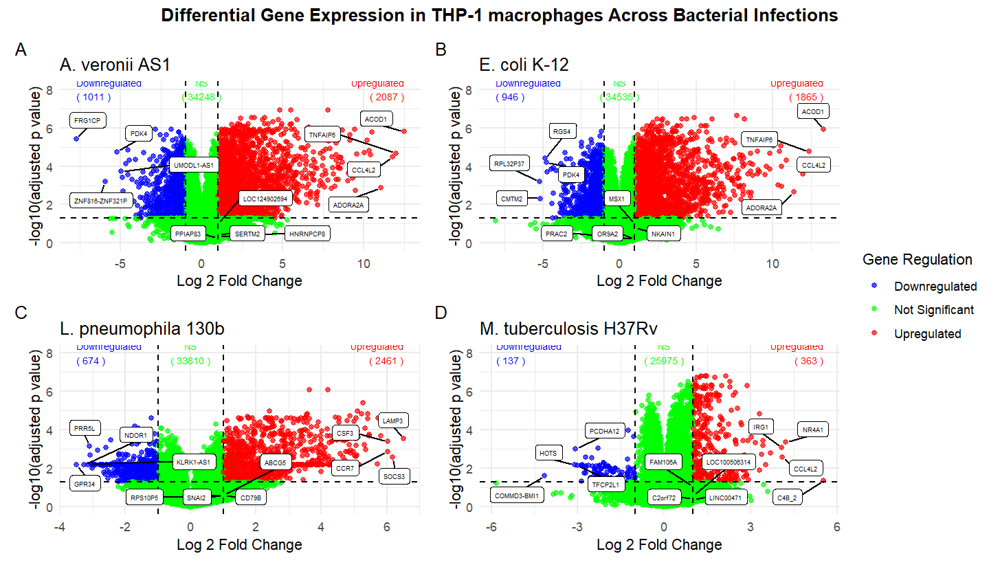
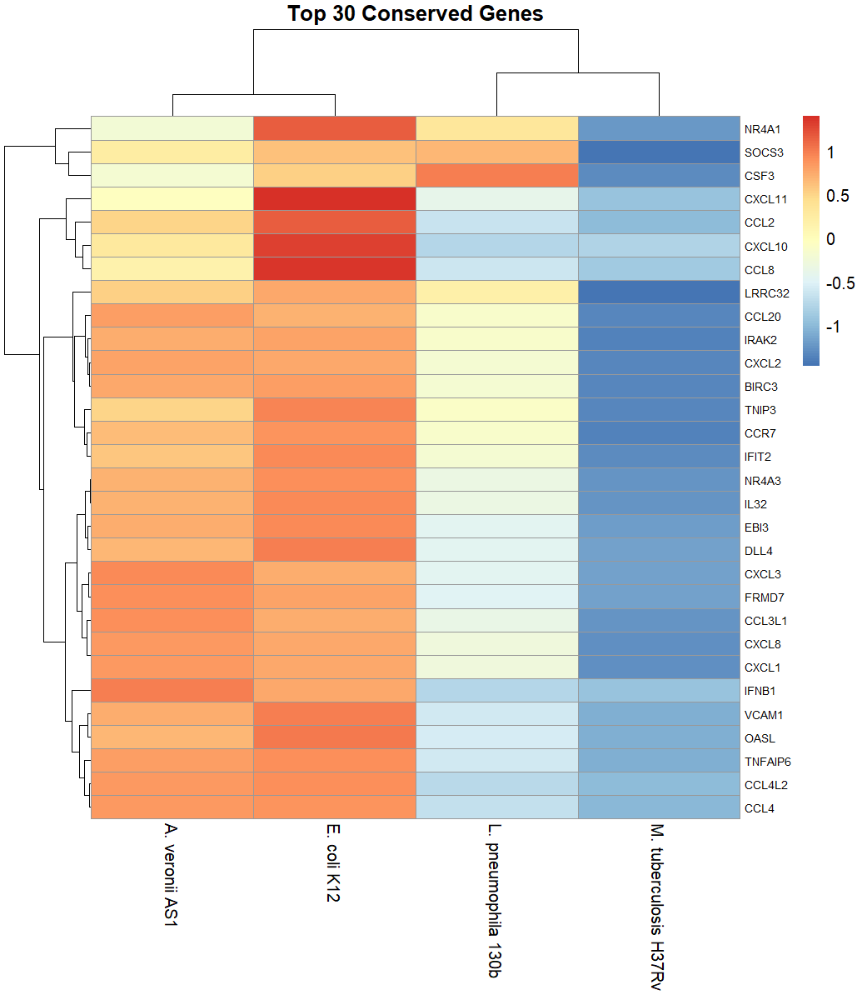
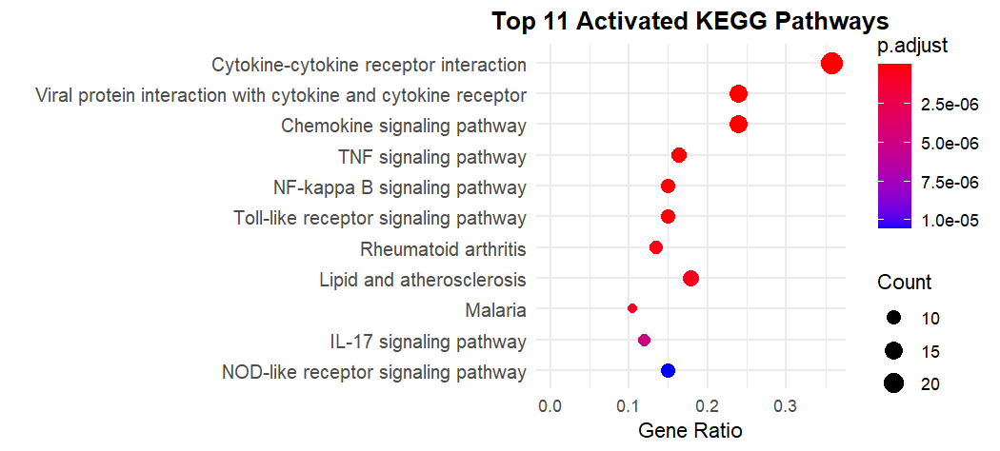

# Conserved Host Response to Bacterial Infections in THP-1 Macrophages
This study investigates conserved transcriptional responses of THP-1-derived macrophages to infection by four bacterial pathogens (Aeromonas veronii AS1, Escherichia coli K-12, Legionella pneumophila 130b, and Mycobacterium tuberculosis H37Rv). Differential gene expression analysis followed by functional enrichment (Gene Ontology and KEGG) identified shared immune-related biological processes and pathways. Network analysis further revealed key genes driving these conserved responses, highlighting common host defense mechanisms across diverse bacterial infections.

# Data Sources
The datasets used in this study were obtained from the NCBI Gene Expression Omnibus (GEO):
- Dataset for Aeromonas veronii and Escherichia coli infections = [GSE273835]: https://www.ncbi.nlm.nih.gov/geo/query/acc.cgi
- Dataset for Legionella pneumophila = [GSM8750865]: https://www.ncbi.nlm.nih.gov/geo/query/acc.cgi
- Dataset for Mycobacterium tuberculosis = [GSE275580]: https://www.ncbi.nlm.nih.gov/geo/query/acc.cgi
All datasets consist of RNA-seq count data from THP-1 macrophages under control and infected conditions.

# Methods
- RNA-seq count data preprocessing
- Differential gene expression analysis using *limma-voom*
- Filtering of significant DEGs (adjusted p-value < 0.05, absolute log2FC > 1)
- Identification of conserved genes across all infections
- Gene Ontology (GO) enrichment analysis
- KEGG pathway enrichment analysis
- Gene-pathway network visualization using cnetplot

# Key Findings
- A total of 108 conserved genes were identified across all four bacterial infections (Aeromonas veronii, Escherichia coli, Legionella pneumophila, and Mycobacterium tuberculosis), indicating a strong shared host transcriptional response in THP-1 macrophages.
- The vast majority of conserved genes (105 genes) were consistently upregulated across all infections, highlighting a dominant activation of host immune responses.
- The conserved gene set was enriched with key immune and inflammatory mediators, including CXCL11, CCL8, CD40, IFNB1, SOCS3, IL32, and TNFAIP6, indicating strong activation of cytokine and chemokine signaling pathways.
- Key immune-related pathways identified included: cytokine-cytokine receptor interaction, chemokine signaling pathway, TNF signaling pathway, NF-kB signaling pathway, and Toll-like receptor signaling pathway. These pathways are central to innate immune activation and inflammatory signaling.
Overall, these findings reveal a highly conserved pro-inflammatory transcriptional signature in macrophages, representing a core host defense mechanism against diverse bacterial infections.

# Key Visualizations
## Differential Gene Expression Across Bacterial Infections

**Figure 1:** Combined volcano plots showing differential gene expression patterns in THP-1 macrophages infected with A. veronii AS1, E. coli K-12, L. pneumophila 130b, and M. tuberculosis H37Rv, respectively. Differentially expressed genes are considered significant if p.adjust < 0.05 and the absolute value of log2FC > 1. NS = not significant
## Conserved Gene Expression Patterns

**Figure 2:** Heatmap of the top 30 conserved differentially expressed genes in THP-1 macrophages across infections with A. veronii AS1, E. coli K-12, L. pneumophila 130b, and M. tuberculosis H37Rv.

# Enriched Biological Pathways

*For full analysis scripts, see the repository contents.*

# Author
Daniel Boadi Danso,
B.Sc Biochemistry,
Kwame Nkrumah University of Science and Technology (KNUST), Ghana.
